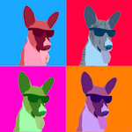
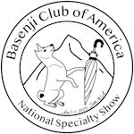

# African Stock Exhibition Catalogs

This monorepo contains the online versions of the catalog for the annual African Stock Exhibition at the **Basenji Club of America's** National Specialty.

|                          [2025](https://ase2025.jaredreisinger.com)                          |                          [2024](https://ase2024.jaredreisinger.com)                          |                          [2023](https://ase2023.jaredreisinger.com)                          |                          [2022](https://ase2022.jaredreisinger.com)                          |
| :------------------------------------------------------------------------------------------: | :------------------------------------------------------------------------------------------: | :------------------------------------------------------------------------------------------: | :------------------------------------------------------------------------------------------: |
|  |  |  |  |

These were originally year-over-year improvements, tracked in separate repos,
which got more and more difficult to maintain.  The once-duplicated [Eleventy](https://11ty.dev) sites now leverage a shared plugin, reducing the per-site implementation to _almost_ just the things that make each site different: the data about the dogs entered and about the show itself.
